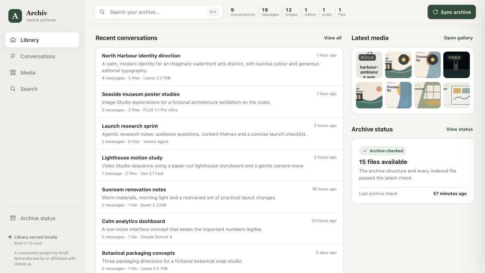
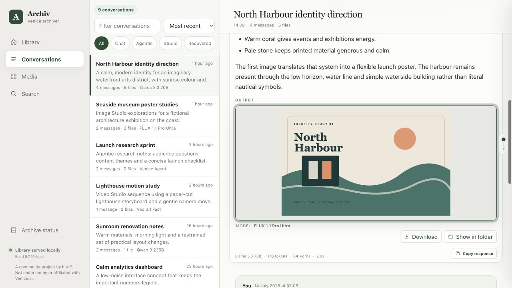
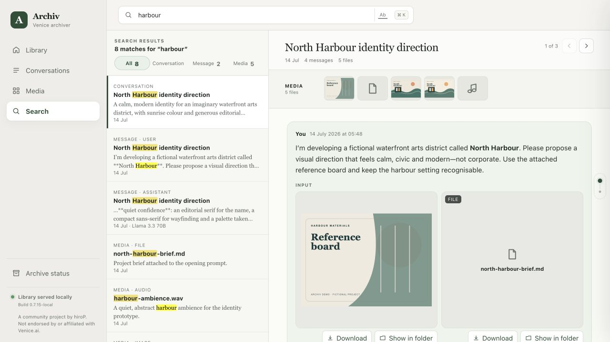
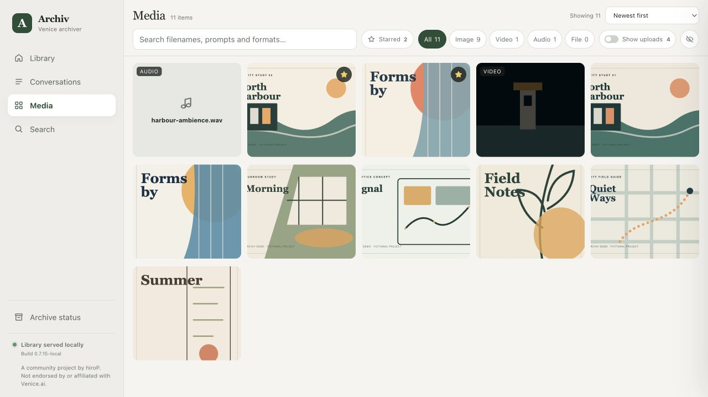
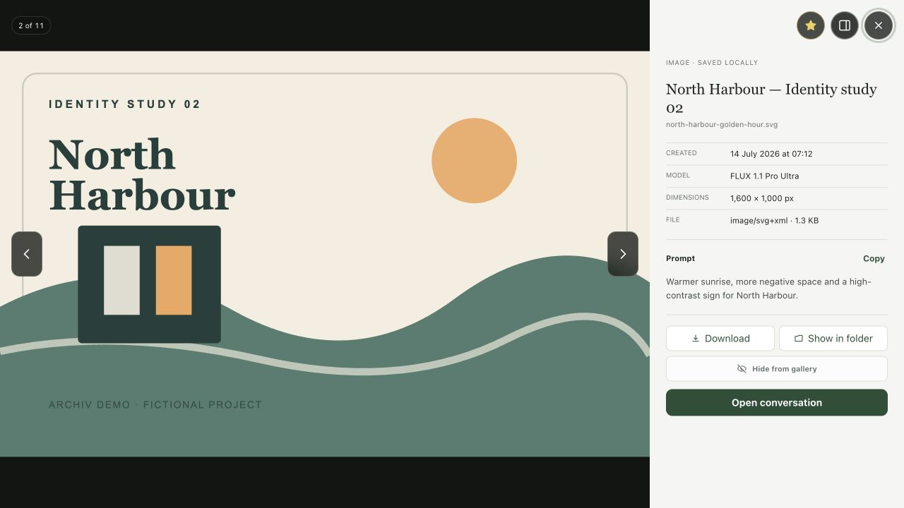
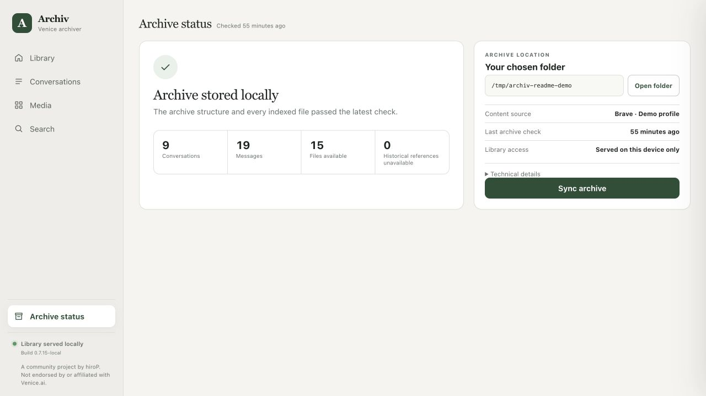
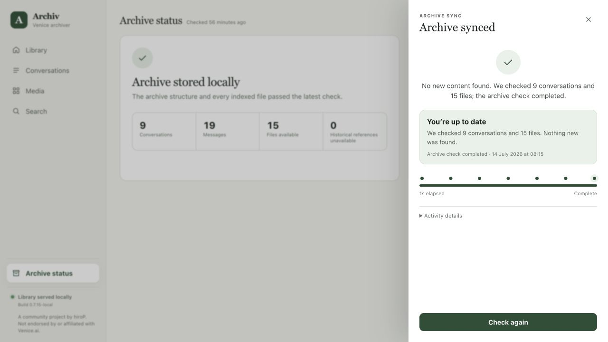
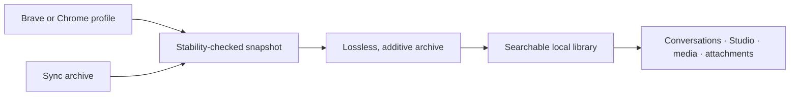

# Archiv


[](LICENSE)
[](https://nodejs.org/)


**A local, searchable backup of the Venice.ai content stored in your browser.**

> [!IMPORTANT]
> **Archiv is a personal project.** It is not endorsed by, affiliated with or supported by Venice.ai. There is no warranty; verify your own archive before deleting anything from the browser. It works for me, but that doesn't mean it will work for you. If you want to use it, apply **caution and common sense**.

Venice keeps all your conversations and gens in browser storage. Clear the browser cache and you lose everything. I did this by accident while testing a website and that pain inspired me to build this.

Archiv makes a copy on your own disk (you specify where), then turns it into a local library you can search and browse. After the first sync, new content is added incrementally so you can keep the local copy up to date really easily. I built it because I wanted a proper, durable archive of my own Venice work.

## Features

- Imports directly from a Brave or Chrome profile and adds later changes with an incremental sync.
- Searches conversations, messages, prompts, filenames and models so you can find what you want.
- Reconstructs normal chats, agentic conversations and Studio sessions with media and attachments in place.
- Provides a filterable full-resolution media gallery with favourites, hidden items, model details and local file actions.
- Keeps verified source snapshots and unknown Venice records alongside the friendly library, so future recovery work still has the raw material.
- Runs entirely on your machine and serves the library only on `127.0.0.1`.

## A look at Archiv

This is what you get with Archiv (note: all content is from a demo account).

[](docs/screenshots/library.jpg)

*The Library keeps recent work, useful totals, the latest generated media and archive health in one place.*

| Conversation reader | Search and review |
| --- | --- |
| [](docs/screenshots/conversation.jpg) | [](docs/screenshots/search.jpg) |
| Inputs, outputs, attachments, model details and response metadata stay in their original context. | Search conversations, messages and media, then review each result without losing the list. |

| Media gallery | Full-resolution viewer |
| --- | --- |
| [](docs/screenshots/media-gallery.jpg) | [](docs/screenshots/media-viewer.jpg) |
| Filter by type, hide uploads or unwanted generations, sort the library and star the good stuff. | Inspect the original file with zoom and keyboard navigation, then download it, reveal it locally or open its conversation. |

| Archive status | Sync feedback |
| --- | --- |
| [](docs/screenshots/archive-status.jpg) | [](docs/screenshots/sync.jpg) |
| See where the archive lives, what was checked and whether historical files are missing. | A sync reports what it is doing and ends with a concrete result—including the reassuring “nothing new” case. |

## How it works



## Browser support

Archiv currently understands two browsers. “Supported” here means it knows the browser's profile locations, Venice storage layout, executable and isolated extraction flow, not merely that the browser happens to use Chromium.

| Browser | Status | Notes |
| --- | --- | --- |
| **Brave** | Recommended | The main development target. Tested end to end on macOS. Windows and Linux discovery paths are included but need more field testing (let me know if you get it working). |
| **Google Chrome** | Supported | Select it with `--browser chrome`. It uses the same extraction pipeline, with profile and executable paths for macOS, Windows and Linux, but has had less real-world testing. |
| Edge, Vivaldi, Opera and stock Chromium | Not currently supported | They share useful Chromium plumbing, but their paths, profile behaviour and locking have not been verified. Adding one should not require a new archive format. |
| Firefox and Safari | Not supported | Their storage and automation models are different enough that they need separate importers. |

Brave is the browser Archiv is built around—and, obviously, **the browser you should be using** anyway. Anything not listed as supported should be treated as unsupported until it has a proper importer and end-to-end tests.


## Quick start

### Requirements

- Git and [Node.js](https://nodejs.org/) 18 or newer
- A Brave or Chrome profile containing Venice data
- Enough free disk space for a temporary safety copy of the browser data and the resulting archive

macOS is tested end to end. Browser discovery includes Windows and Linux paths, but those platforms still need more real-world testing.

```bash
git clone https://github.com/docherty/archiv.git
cd archiv
npm start -- --archive "/path/to/venice-archive" --browser brave
```

To use Chrome:

```bash
npm start -- --archive "/path/to/venice-archive" --browser chrome
```

There are no third-party runtime packages to install. On the first run Archiv:

1. Finds the browser profile that contains Venice data.
2. Saves that choice inside the archive folder.
3. Takes a stability-checked copy of the browser data without writing back to Venice.
4. Extracts conversations, Studio records, attachments and media.
5. Builds the library and serves it at `http://127.0.0.1:43110/`.

If more than one profile contains Venice data, name the one you want:

```bash
npm start -- --archive "/path/to/venice-archive" --browser brave --profile "Work"
```

Closing the browser is safest for the first import. For later updates it can stay open, but leave Venice alone until the sync finishes. Archiv reconciles harmless browser-journal changes in short passes and accepts a snapshot only when the copy exactly matches a quiet storage window. If the profile keeps changing, it removes the incomplete candidate and asks you to quit the browser fully.

## Using the library

After the first import, the archive is just a local app and an ordinary folder on disk.

- Search conversations, messages, prompts, filenames and models, with whole-word matching when you need it.
- Read normal, agentic and Studio timelines with inputs and outputs in place.
- Browse generated media, hide uploads or unwanted generations from the default view, filter by type, sort by date, session, model or filename, and star favourites.
- Inspect full-resolution images with zoom controls, a pan navigator, keyboard navigation and file information.
- Preview common attachments, download a file or reveal it in Finder/Explorer.
- Open **Sync archive** from Library or Archive status, then choose **Fetch new content** to add later Venice activity.

Updates are additive. Existing verified captures are not rewritten. **Fetch new content** first checks a lightweight source checkpoint and reports that the archive is already current when nothing changed. When there is a delta, the extractor copies only changed stores and new or modified OPFS files.

## What is captured

- Regular and agentic conversations
- Messages, model names, timestamps and saved response metadata
- Image Studio and Video Studio sessions
- Generated images, video and audio
- Uploads and message attachments
- Venice IndexedDB/RxDB stores, including unknown stores retained for future recovery
- Origin Private File System (OPFS) files
- Lossless source snapshots, normalized indexes and integrity results

The source layer matters. Even if the current viewer does not understand a future Venice record, the raw recoverable store is still kept.

## Read this before deleting anything

This is backup software built by one person against somebody else's evolving browser schema. Treat it accordingly.

- A successful run does not prove that Venice still had every historical file available to copy.
- Open the library, spot-check important conversations and media, and review unresolved files in Archive status.
- Keep another copy of anything genuinely irreplaceable.
- Do not clear your Venice browser data until you have verified the archive yourself.
- There is no warranty. Use it at your own risk.

The tool never writes to Venice storage. Restore into Venice, cross-device merge and live IndexedDB writes are deliberately out of scope.

## Privacy and security

The web service binds to `127.0.0.1`; it is not exposed to your LAN or the internet. Browsing an existing archive is local. Fetching new content opens Venice from a temporary isolated copy of the selected browser profile; that workspace is removed afterward.

Treat the whole archive as sensitive. The readable library contains your conversations and media, while lossless browser snapshots can also retain cookies, authentication material and other site state needed for recovery. Keep it on an encrypted device with access limited to your account. If you put the archive in a cloud-synced folder, that provider's sync, access and retention rules apply.

See [SECURITY.md](SECURITY.md) for the threat model and reporting route.

## Inside the archive folder

The archive is ordinary, inspectable data:

```text
captures/           verified extracted captures
raw-snapshots/      immutable browser safety copies
indexes/            searchable conversation, message and media indexes
media/              files imported from older archive packages, when present
materialized-media/ full-resolution files decoded from source stores
recovered-media/    separately recovered historical files
recovered-content/  separately recovered conversations and Venice media
.venice-archive/    source configuration, local preferences and update history
```

Check the archive without loading it all into memory:

```bash
npm run verify:archive -- /absolute/path/to/archive
```

If you have older Venice downloads, audit them before importing anything:

```bash
npm run audit:recovery -- --archive "/path/to/archive" --source "/path/to/older-downloads"
npm run recover:legacy -- --archive "/path/to/archive" --backup "/path/to/old-backup.json" --media-dir "/path/to/older-media"
```

Both commands are read-only unless you add `--apply`. Recovered content goes into a separate layer, and ambiguous matches are left alone.

## Useful commands

```bash
# Find browser profiles with Venice data
npm run archive -- discover --browser brave

# Fetch and rebuild without starting the web app
npm run archive -- sync --archive "/path/to/venice-archive" --allow-running

# Rebuild full-resolution media retained in source stores
npm run repair:media -- --archive "/path/to/venice-archive"

# Verify the latest controlled capture
npm run archive -- verify-capture --archive "/path/to/venice-archive"
```

The deeper implementation notes live in [the standalone CLI guide](docs/STANDALONE-ARCHIVE-CLI.md) and [the archive verification guide](docs/VERIFY-LOCAL-ARCHIVE.md).

## Troubleshooting

**Archiv chose the wrong profile or found no Venice data.** List the candidates, then start it again with the exact profile name:

```bash
npm run archive -- discover --browser brave
npm start -- --archive "/path/to/venice-archive" --browser brave --profile "Work"
```

**The snapshot says browser storage kept changing.** Stop using Venice and try again. If it still cannot find a quiet window, quit every Brave or Chrome window completely, wait a few seconds and rerun the sync.

**The interface shows an older build after an update.** Stop the local service with `Control-C`, start it again and reload the page. The interface and API are served by that process.

**Archive status reports missing historical files.** Archiv cannot copy files that Venice had already removed from browser storage. Keep the current archive intact and use the recovery audit above to check older downloads before applying any recovery operation.

## Optional browser extension

Most people should skip this section. The standalone app handles first import, later syncs, browsing and search without installing anything in the browser or granting page permissions.

I started building this project as an extension but then switched to the current cli/web ui model. I have kept the [`extension/`](extension/) directory as a developer and diagnostic extra. It can be useful if you want to inspect what the Venice page exposes, reproduce a browser-storage edge case or create the older browser-generated ZIP format. The standalone app can still import those ZIPs:

```bash
npm run archive -- import --archive "/path/to/venice-archive" --zip "/path/to/venice-local-archive.zip"
```

To try it, open Brave or Chrome's extensions page, enable **Developer mode**, choose **Load unpacked**, and select this repository's `extension/` directory. Reload Venice once after loading it. Treat this as an optional technical tool, not part of the normal Archiv workflow.

## Updating Archiv

Stop the running service with `Control-C`, pull the latest commits, then start it again with the same archive folder. Restarting matters because the interface and local API are served by that process.

```bash
git pull
npm start -- --archive "/path/to/venice-archive"
```

## Development

```bash
npm test
```

The test suite covers normalization, incremental extraction, archive integrity, search, the loopback service, security boundaries and the deliberately disabled restore path. Machine-local credentials, browser profiles and archive data are ignored and must never be committed.

Contributions are welcome. Please read [CONTRIBUTING.md](CONTRIBUTING.md) before opening a pull request—especially the rule about using synthetic fixtures instead of personal archive data.

## License

I built this because I needed it, and I hope it’s useful to the community. My aim is for folks to use it and, if they improve it, share those improvements back with the community. I’ve licensed this project under the GNU AGPL v3 so that improvements remain available to everyone. If your use isn’t compatible with the AGPL, please reach out to discuss options.

Archiv is licensed under the [GNU Affero General Public License v3.0 only](LICENSE) (`AGPL-3.0-only`). Third-party software retains its own terms and is listed in [THIRD_PARTY_NOTICES.md](THIRD_PARTY_NOTICES.md).
